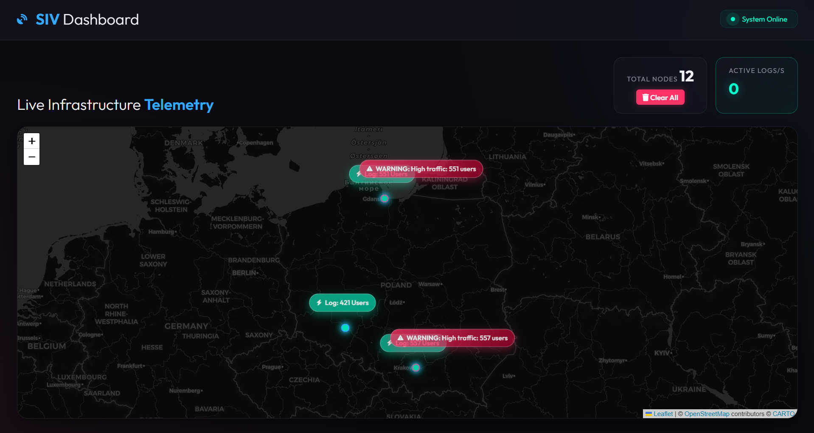
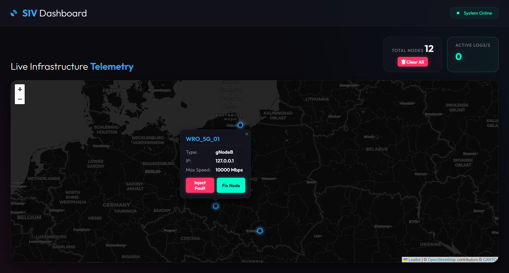

# Smart Infrastructure Validator 📡

A microservices-based platform for real-time 5G/4G network telemetry aggregation, visualization, and automated fault-injection testing. Built to simulate and validate the behavior of distributed Base Transceiver Stations (BTS) at scale.


---

## 📸 Screenshots

| Dashboard (Map View) | Fault Injection |
|---|---|
|  |  |

---

## 🌟 Features

- **Real-Time Telemetry Aggregation** — Centralized FastAPI aggregator receiving live metrics (CPU temperature, active users, throughput) from distributed BTS nodes.
- **WebSocket Event Streaming** — Live push notifications for active alarms and real-time dashboard updates without polling.
- **Configurable Node Simulators** — Dockerized 4G (eNodeB) and 5G (gNodeB) simulated nodes generating realistic, stateful telemetry in background loops.
- **Fault Injection Framework** — Dedicated API endpoints to trigger specific hardware failures (e.g., cooling fan breakdown) and observe system resilience.
- **Interactive Geospatial UI** — Minimalist, glassmorphism-styled frontend built with Vanilla JS and Leaflet.js displaying node positions, live metrics, and alarm feeds on a map.
- **PostGIS Geospatial Storage** — Node locations stored as PostGIS `POINT` geometry (SRID 4326), enabling spatial queries via SQLAlchemy + GeoAlchemy2.
- **Automated Acceptance Tests** — Robot Framework test suites covering smoke checks and end-to-end fault management scenarios.

---

## 🚀 Tech Stack

| Layer | Technology |
|---|---|
| **Backend** | Python 3.11, FastAPI, SQLAlchemy, GeoAlchemy2 |
| **Database** | PostgreSQL 16 + PostGIS (via TimescaleDB image) |
| **Frontend** | HTML5, Vanilla CSS, JavaScript, Leaflet.js |
| **Infrastructure** | Docker, Docker Compose |
| **Testing** | Robot Framework, RequestsLibrary |

---

## 🛠️ Quick Start

The entire project is containerized. Ensure you have **Docker** and **Docker Compose** installed.

**1. Clone the repository:**
```bash
git clone https://github.com/Barry4747/SmartInfrastructureValidator
cd SmartInfrastructureValidator
```

**2. Configure environment variables:**
```bash
cp .env.example .env
```
> The default values in `.env.example` work out of the box for local development.

**3. Start all services:**
```bash
docker compose up -d --build
```

**4. Open the dashboard:**

Navigate to [http://localhost:8000](http://localhost:8000) in your browser.

After startup, the simulator containers will automatically register with the aggregator and begin streaming telemetry. Nodes will appear on the map within a few seconds.

---

## 🏗️ Architecture

The system is composed of three types of services orchestrated by Docker Compose:

```
┌────────────────────────────────────────────────┐
│                  Browser (UI)                   │
│        Leaflet.js + WebSocket client            │
└───────────────────┬────────────────────────────┘
                    │ HTTP / WebSocket
┌───────────────────▼────────────────────────────┐
│             Aggregator (FastAPI)                │
│   REST API  │  WebSocket Manager  │  Static UI  │
└──────┬──────┴──────────────────────────────────┘
       │ SQLAlchemy + GeoAlchemy2
┌──────▼──────────────────────────────────────────┐
│   PostgreSQL 16 + PostGIS (TimescaleDB image)   │
└─────────────────────────────────────────────────┘
       ▲ HTTP (registration + telemetry)
┌──────┴──────────────────────────────────────────┐
│   BTS Simulators (3x FastAPI + asyncio loop)    │
│   sim_wroclaw (gNodeB) │ 5G │ port 8001         │
│   sim_krakow  (eNodeB) │ 4G │ port 8002         │
│   sim_gdansk  (gNodeB) │ 5G │ port 8003         │
└─────────────────────────────────────────────────┘
```

Each simulator:
- Registers itself with the aggregator on startup (with retry logic)
- Runs an `asyncio` background loop that generates and sends telemetry every 5 seconds
- Exposes fault injection endpoints (`/api/fault/cooling`, `/api/fault/fix`)

---

## 🗃️ Database Schema (ERD)

> Source: [`docs/SmartInfrastructureValidator_ERD.svg`](docs/SmartInfrastructureValidator_ERD.svg)

```
network_node (UUID PK)
    ├── node_status_log (composite PK: timestamp + node_id FK)  [TimescaleDB Hypertable]
    ├── hardware_component (UUID PK, node_id FK)
    └── active_alarm (UUID PK, node_id FK, component_id FK nullable)
```

| Table | Description |
|---|---|
| `network_node` | Core registry of all base stations. Stores geospatial location as `PostGIS POINT`, node type, topology path, and vendor config. |
| `node_status_log` | Append-only time-series table logging CPU temp, user count, and throughput per node per heartbeat. |
| `hardware_component` | Physical components (antenna, transceiver, cooling fan, power supply) with OK/DEGRADED/FAILED status. |
| `active_alarm` | Alarm events raised automatically when telemetry exceeds thresholds (e.g., CPU > 50°C). |

---

## 💉 Fault Injection

Faults can be triggered from the **UI map popup** or directly via API:

| Fault | Endpoint | Effect |
|---|---|---|
| Cooling Failure | `POST http://localhost:<PORT>/api/fault/cooling` | CPU temperature begins rising rapidly (up to 95°C) |
| Resolve All Faults | `POST http://localhost:<PORT>/api/fault/fix` | Temperature resets to baseline; node recovers |

Replace `<PORT>` with the simulator's exposed port (`8001`, `8002`, or `8003`).

The aggregator automatically detects overheating (> 50°C) and broadcasts `CRITICAL` or `WARNING` alarm events via WebSocket to all connected dashboards.

---

## 🧪 Testing

Automated acceptance tests are written in **Robot Framework** and test the live Docker environment end-to-end.

### Prerequisites

```bash
cd tests
pip install -r requirements.txt
```

### Test Suites

| Suite | File | Description |
|---|---|---|
| Smoke Tests | `suites/01_smoke_tests.robot` | Verifies the aggregator API is alive and at least one simulator has registered. |
| Fault Management | `suites/02_fault_management.robot` | End-to-end test: verifies registration, injects a cooling fault, waits for log propagation, and asserts the node remains reachable. |

### Running the Tests

> **Prerequisite:** start the Docker environment first (`docker compose up -d --build`) and wait ~10 seconds for simulators to register.

```bash
# Run all test suites
robot --outputdir tests/results tests/suites/

# Run only smoke tests
robot --outputdir tests/results tests/suites/01_smoke_tests.robot

# Run fault management tests with a specific simulator target
robot --variable SIMULATOR_URL:http://localhost:8001 --outputdir tests/results tests/suites/02_fault_management.robot
```

Results (HTML report + XML log) are saved to `tests/results/` and are excluded from version control.

### Custom Libraries

| Library | Description |
|---|---|
| `AggregatorLibrary.py` | Keywords for querying the aggregator API: verify node registration, count registered nodes. |
| `SimulatorLibrary.py` | Keywords for fault management: inject cooling fault, fix all faults. |

---

## 📁 Project Structure

```
SmartInfrastructureValidator/
├── aggregator/               # Centralized metric collection service
│   ├── crud/                 # Database access layer (nodes, logs)
│   ├── routers/              # REST API routes (nodes, telemetry) + WebSocket
│   ├── static/               # Frontend assets (HTML, CSS, JS, Leaflet.js)
│   ├── models.py             # SQLAlchemy ORM models + hybrid geo properties
│   ├── schemas.py            # Pydantic request/response schemas
│   ├── database.py           # DB engine and session factory
│   ├── ws_manager.py         # WebSocket connection manager
│   └── main.py               # FastAPI app entry point + lifespan
├── bts_simulator/            # Configurable BTS simulator service
│   ├── client.py             # HTTP client for aggregator (registration + telemetry)
│   ├── state.py              # Stateful node model (temperature decay/recovery)
│   ├── config.py             # Pydantic settings (env-driven per container)
│   ├── schemas.py            # Shared Pydantic models (registration, telemetry)
│   ├── fleet_generator.py    # Standalone script: bulk-simulate 50 virtual nodes
│   └── main.py               # FastAPI app + background telemetry loop
├── tests/                    # Robot Framework acceptance test suite
│   ├── suites/               # Test cases (smoke, fault management)
│   ├── libraries/            # Custom RF Python libraries
│   ├── resources/            # Shared variables (URLs, node names)
│   └── requirements.txt      # Test dependencies
├── docs/                     # Project documentation assets
│   ├── simulator_ERD.puml    # PlantUML entity-relationship diagram
│   ├── main_screen.png       # Dashboard screenshot
│   └── action_screen.png     # Fault injection screenshot
├── docker-compose.yml        # Full infrastructure definition (db + aggregator + 3x sim)
├── .env.example              # Template for required environment variables
└── .gitignore
```

---

## 📄 License

This project is for demonstration and portfolio purposes. Feel free to explore, fork, or adapt it.
